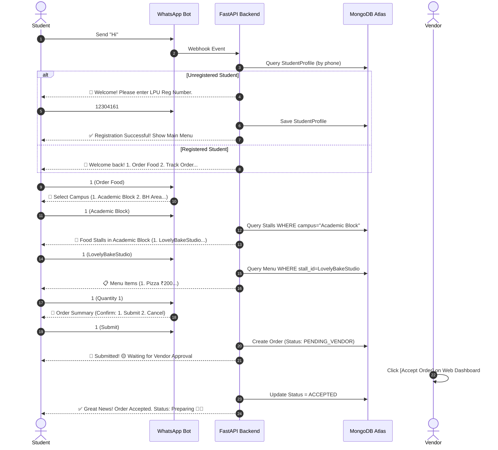

# 🍔 SmartFood LPU — Complete Project Presentation & Documentation

## 1. Executive Summary
**SmartFood LPU** is an AI-powered, multi-tenant campus food ordering and delivery system designed to streamline food orders across Lovely Professional University (LPU). It provides an automated, Swiggy/Zomato-like ordering experience via a **WhatsApp Cloud API AI Chatbot**, alongside dedicated **Web Portals** for Students, Vendors, and Administrators.

---

## 2. Technology Stack & System Architecture

| Tier | Technology | Key Usage |
|---|---|---|
| **Backend Framework** | **FastAPI (Python 3.9+)** | Asynchronous REST APIs, High Performance |
| **Database** | **MongoDB Atlas (Cloud)** | NoSQL Database for Users, Stalls, Menu, Orders, Profiles |
| **Frontend Web App** | **React.js + Tailwind CSS** | Multi-role Portals (Student, Vendor, Admin) |
| **Messaging Integration** | **WhatsApp Cloud API (Meta)** | AI Conversational Food Ordering & Order Tracking |
| **AI Integration** | **Google Gemini AI** | Natural Language Processing & Recommendations |
| **Deployment** | **Render (Backend) + Vercel (Frontend)** | 24/7 Cloud Hosting & Automated CI/CD Pipelines |

---

## 3. Core System Components & Portals

### 🤖 A. WhatsApp AI Chatbot
- **1-Time Verification:** Automated check against `StudentProfile` collection for registration number before granting access to ordering menus.
- **Campus Location Selection:** Browse stalls by campus:
  1. `Academic Block`
  2. `BH Area`
  3. `Girls Hostel`
  4. `Uni Mall`
- **Dynamic Menu Navigation:** Multi-step ordering (Campus ➔ Stall ➔ Menu Item ➔ Quantity ➔ Order Summary ➔ Confirmation).
- **Live Order Tracking (`2️⃣ Track My Order`):** Displays real-time vendor status and estimated ready time.
- **Automated WhatsApp Status Alerts:** Instant alerts sent to students when Vendors Accept, Prepare, Ready, or Complete orders.

### 👨‍🍳 B. Vendor Portal (`/vendor/orders`)
- **Live Order Dashboard:** Auto-refreshes incoming order requests every 30 seconds.
- **Order Lifecycle Buttons:**
  - `[Accept Order]` ➔ Transitions status to `ACCEPTED` & sends WhatsApp notification.
  - `[Reject]` ➔ Transitions status to `REJECTED` & sends WhatsApp notification.
  - `[Mark as Preparing]` ➔ Notifies student food is being prepared.
  - `[Mark as Ready]` ➔ Notifies student to pick up food from stall.
  - `[Complete Order]` ➔ Marks order completed.
- **Stall & Menu Management (`/vendor/my-stall`, `/vendor/menu`):** Full CRUD control over stall opening status, category management, item availability, and pricing.

### 🎓 C. Student Web Portal
- Browse campus stalls visually, filter items by category, add items to cart, select pickup time slots, and track active orders.

### 🛡️ D. Admin Web Portal (`/admin/dashboard`)
- Global system overview, stall approvals, user management, and platform analytics.

---

## 4. Live Database Architecture (MongoDB Atlas)

- **Total Active Food Stalls:** 16 Stalls
- **Total Uploaded Menu Items:** 760 Items

### 🏬 Campus Distribution:
1. **Academic Block (424 Menu Items):**
   - LovelyBakeStudio (94 items)
   - Basant Icecream (141 items)
   - DimSum Box (56 items)
   - Nescafe (44 items)
   - South City Cafe (36 items)
   - Gupta Canteen (7 items)
   - Govinda Fresh Bites (2 items)
   - Burger House (2 items)
2. **BH Area / Boys Hostel (334 Menu Items):**
   - Food Factory (113 items)
   - Hungry Panda (95 items)
   - Canteen_BH6 (78 items)
   - Tripti (36 items)
   - Pakka Adda (31 items)
   - Hangouts (23 items)
3. **Girls Hostel (2 Menu Items):**
   - Amritsar zaika (1 item)
   - Zaika (1 item)

---

## 5. Swiggy/Zomato WhatsApp Order Lifecycle

---

## 6. Current Status & Health Check

- **GitHub Repository:** Up to date (`origin/main`)
- **MongoDB Atlas:** 100% Online with 16 Stalls & 760 Menu Items
- **Backend Service:** Live on Render
- **Frontend App:** Live on Vercel
- **WhatsApp Webhook:** Active & Verified with Meta Cloud API

---

## 7. Teacher/Evaluator Viva Q&A Guide

**Q1: How did you implement 1-time student registration on WhatsApp?**  
*Answer:* We read the sender's phone number from the Meta WhatsApp webhook payload, check the `student_profiles` MongoDB collection. If not found, the bot prompts for their LPU Registration Number, validates it, and stores the mapping before showing the main menu.

**Q2: How do menu items reference campus locations without duplication?**  
*Answer:* Each Stall document has a `campus` field (`Academic Block`, `BH Area`, `Girls Hostel`, `Uni Mall`). Menu items reference `stall_id`. When a student picks a campus, we filter stalls by `campus`, avoiding duplicate menu records or separate campus collections.

**Q3: How are Vendors notified of new WhatsApp orders?**  
*Answer:* Orders created via WhatsApp are saved in MongoDB with status `PENDING_VENDOR`. The Vendor Web Dashboard polls `/orders/vendor` every 30 seconds, presenting `Accept` and `Reject` buttons.

**Q4: How do Students receive status updates on WhatsApp?**  
*Answer:* When a Vendor updates the order status via the dashboard API (`PATCH /admin/orders/{id}/status`), `order_service.py` triggers `send_whatsapp_message()` to notify the student asynchronously.
